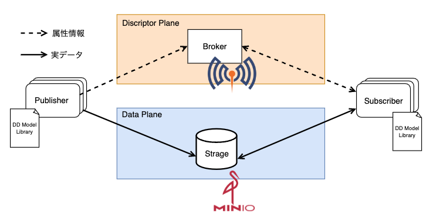
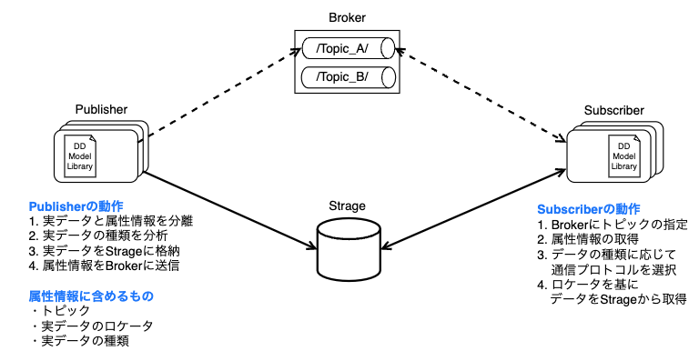

# DD-PubSub
## System Architecture Overview

## System Flow

## Prerequisites
- Go version 1.15 or higher
- Docker
## Setup Environment
### Install DD-PubSub using go get:
```bash
go get github.com/malcoscos/dd-pubsub
go get github.com/eclipse/paho.mqtt.golang
```
### Install mosquitto
Install Mosquitto as a broker:
``` bash
docker pull eclipse-mosquitto
docker run -it -p 1883:1883  --name mosquitto eclipse-mosquitto
```
### Build MinIO Storage
Construct MinIO storage on the storage server:
``` bash
docker pull minio/minio
docker run -p 9000:9000 --name minio1 -e "MINIO_ROOT_USER=youraccesskey" -e "MINIO_ROOT_PASSWORD=yoursecretkey" -v /mnt/data:/data minio/minio server /data --console-address ":9001"
```
## Usage
### Publisher
``` golang
import (
  "fmt"
  "log"
  "os"

  dd_pubsub "github.com/malcoscos/dd-pubsub"
  mqtt "github.com/eclipse/paho.mqtt.golang"
)

func main() {
  // configure MQTT client options
  opts := mqtt.NewClientOptions()
  // add broker
  broker := fmt.Sprintf("tcp://%s:%s", "127.0.0.1", "1883")
  opts.AddBroker(broker)
  // create MQTT client
  c := mqtt.NewClient(opts)
  if token := c.Connect(); token.Wait() && token.Error() != nil {
      log.Fatalf("Error connecting MQTT client: %s", token.Error())
  }
  
  // define arguments to publish data
  pub_arg := dd_pubsub.PubArg{
      Topic:      "your_topic_name",
      Qos:        1,
      Retained:   false,
      Payload:    []byte("your message"),
      MqttClient: c,
  }
  // publish the data
  dd_pubsub.Publish(&pub_arg)
  // disconnect from MQTT broker
  c.Disconnect(250)
}

```
### Subscriber
```golang
import (
  "fmt"

  mqtt "github.com/eclipse/paho.mqtt.golang"
  dd_pubsub "github.com/malcoscos/dd-pubsub"
)

func main(){
  // configure MQTT client options
  opts := mqtt.NewClientOptions().AddBroker("tcp://127.0.0.1:1883")
  // create MQTT client
  c := mqtt.NewClient(opts)
  if token := c.Connect(); token.Wait() && token.Error() != nil {
      fmt.Printf("Error connecting MQTT client: %s\n", token.Error())
      return
  }

  // define arguments to subscribe to data
  sub_arg := dd_pubsub.SubArg{
      Topic:      "your_topic_name",
      Qos:        1,
      MqttClient: c,
  }
  // subscribe to the topic
  dd_pubsub.Subscribe(&sub_arg)
  // disconnect from MQTT broker
  c.Disconnect(250)
}

```